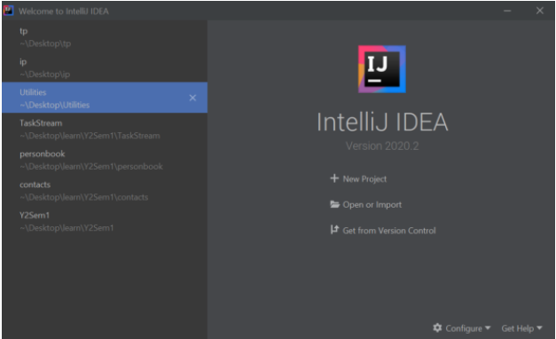
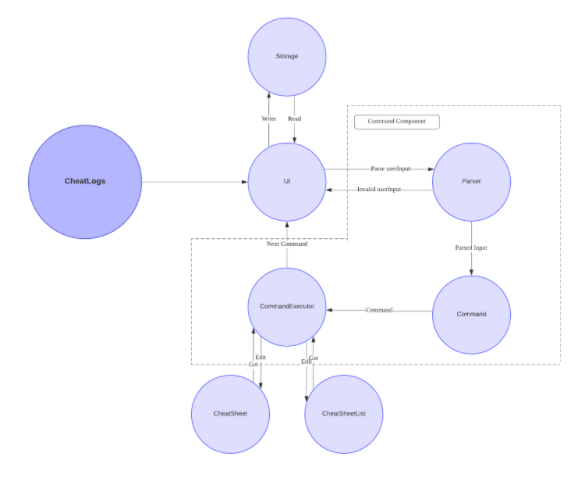
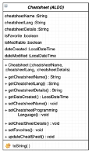

<h1 align="center">  CheatLogs Developer Guide </h1>

Welcome to the official developer guide of CheatLogs, a free and open-source cheatsheet manager with blazing fast organization, editing and searching via both a command-line interface (CLI) and a graphical user interface (GUI) .

The table of contents below lets you easily access the documentation for CheatLogs's architecture and feature design/implmentation details.

> :bulb: Here are some patterns you will come across and their definitions.
> ------
>|Pattern|Definition|
>|--|--|
>| :bulb: |Tip on current section  |
>|:exclamation:|Warning of potential error|
>|:memo:|Important details to note|
>| [:arrow_up_small:](#table-of-contents)| Returns to table of contents on left click|
>|**bold**|Key terms specific to CheatLogs|
>|*italics*|Files|
>|`Snippets`|Typed input or output going into or out of CheatLogs|

 

# Table of Contents

* [1. Introduction](#introduction)
* [2. Purpose](#purpose)
* [3. Setting Up, Getting Started](#setting-up-getting-started)
    * [3.1. Prerequisites](#prerequisites)
    * [3.2. Running the Project](#running-the-project)
    * [3.3 Importing into IntelliJ \[optional\]](#importing-to-intellij)
* [4. Design](#design)
    * [4.1. Architecture](#architecture)
    * [4.2. Components](#components)
         * [4.2.1. User Interface](#user-interface)
	        * [4.2.1.1. UserSesssion](#user-sesh)
	        * [4.2.1.2. Input](#in)
	        * [4.2.1.3. Output](#out)
        * [4.2.2. Command Parser](#command-parser)
        * [4.2.3. Command](#command)
            * [4.2.3.1. FinderCommand](#findercommand)
            * [4.2.3.2. Add](#add)
            * [4.2.3.3. Edit](#edit)
            * [4.2.3.4. View](view)
            * [4.2.3.5. Exit](#exit)
            * [4.2.3.6. List](#list)
            * [4.2.3.7. Find](#find)
            * [4.2.3.8. Setting](#setting)
            * [4.2.3.9. Delete](#delete)
            * [4.2.3.10. Clear](#clear)
            * [4.2.3.11. Favourite](#favourite)
            * [4.2.3.12. Exit](#help)
        * [4.2.4. Cheat Sheet Structure](#cheat-sheet-structure)
        * [4.2.5. Cheat Sheet Management](#cheat-sheet-management)
        * [4.2.6. Data Storage](#data-storage)
            * [4.2.6.1 Writing files](#file-writer-design)
            * [4.2.6.2 Reading files](#file-reader-design)
            * [4.2.6.3 Deleting files](#file-destroyer-design)
* [5. Implementation](#implementation)
    * [5.1. Parsing of Data to Construct Commands](#parsing-of-data-to-construct-commands)
    * [5.2. Editing Feature](#editing-feature)
    * [5.3. Sorting Feature](#sorting-feature)
    * [5.4. Data Management](#data-management)
        * [5.4.1 Writing files](#impln-file-writer)
        * [5.4.2 Reading files](#impln-file-reader)
        * [5.4.3 Deleting files](#impln-file-destroyer)
    * [5.5. Changing default settings](#settings-implementation)
    * [5.6. Colour coding for code snippet](#colour-coding-for-code-snippet)
* [6. Appendix: Documentation](#appendix-documentation)
* [7. Appendix: Logging](#appendix-logging)
* [8. Appendix: Testing](#appendix-testing)
    * [8.1 Executing tests](#appendix-executing-tests)
    * [8.2 Types of tests](#appendix-types-of-tests)
* [9. Appendix: Dev-ops](#appendix-dev-ops)
    * [9.1 Build automation](#appendix-build-automation)
    * [9.2 Making a new release](#appendix-new-release)
* [10. Appendix: Requirements](#appendix-requirements)
    * [10.1. Product scope](#product-scope-appendix)
    * [10.2. User stories](#user-stories)
    * [10.3. Use cases](#use-cases)
        * [10.3.1 Use cases](#use-cases-add)
        * [10.3.2 Use cases](#use-cases-edit)
        * [10.3.3 Use cases](#use-cases-delete)
        * [10.3.4 Use cases](#use-cases-clear)
        * [10.3.5 Use cases](#use-cases-favourite)
        * [10.3.6 Use cases](#use-cases-find)
        * [10.3.7 Use cases](#use-cases-view)
        * [10.3.8 Use cases](#use-cases-list)
        * [10.3.9 Use cases](#use-cases-exit) 
    * [10.4. Non-Functional Requirements](#non-functional-requirements)
* [11. Appendix: Instructions for manual testing](#appendix-instructions-for-manual-testing)
    * [11.1. Start-up with preloaded data and restart with save data](#manual-test-1)
    * [11.2. Adding cheatsheets](#manual-test-2)
    * [11.3. Editing cheatsheets](#manual-test-3)
    * [11.4. Viewing cheatsheets](#manual-test-4)
    * [11.5. Finding cheatsheets](#manual-test-5)
    * [11.6. Deleting cheatsheets](#manual-test-6)
    * [11.7. Clearing cheatsheets](#manual-test-7)
    * [11.8. Add/remove cheatsheets to favourites](#manual-test-8)

 

# 1. Introduction [:arrow_up_small:](#table-of-contents)

The motivation behind CheatLogs is to reduce the time spent to scroll through pages of stack overflow posts or online documentation sites to find a syntax for a programming language, which is very common for novice programmers. 

**CheatLogs** allows it's user to access cheat sheets and notes for various programming syntax and functions. This gives novice programmers a way faster to get references as they build their applications. It also provides a set of preloaded cheatsheets for common languages novice programmers adopt. It consists of both a command line interface and a graphical user interface. Below is a summary of all the commands.

To cheatsheets in the list of cheatsheets:  `add`, `delete`, or`clear` 

To modify properties of a specific cheatsheet: `edit` or `favorite`.

To get specific cheatsheets:  `find`, `view`  and `list`

To use more general commands:  `help` , `set`, `exit`

# 2. Purpose [:arrow_up_small:](#table-of-contents)

This document specifies the high-level architecture and software design decisions of CheatLogs and aims to quickly get developers familiar with the project. 

# 3. Setting Up, Getting Started [:arrow_up_small:](#table-of-contents)

## 3.1. Prerequisites [:arrow_up_small:](#table-of-contents)

1. JDK 11.0.8
2. Java IDE (IntelliJ Recommended)

CheatLogs has been developed on Java 11 and may not be supported on other versions. 
You are free to use any java file editor and run the program by following the step by step guide below. 

## 3.2. Running the Project [:arrow_up_small:](#table-of-contents)

1. Ensure you have Java 11 or above installed in your Computer.
2. Download the latest CheatLogs.jar from [here](https://github.com/AY2021S1-CS2113T-W11-3/tp/releases).
3. Move the file to a folder you want to use as the home folder for this application.
4. Invoke java -jar CheatLogs.jar on the command line to run the program. A welcome message should appear, as shown below.

## 3.3 Importing into IntelliJ [optional] [:arrow_up_small:](#table-of-contents)

In case you prefer to use IDEs to develop. 
IntelliJ IDEA community edition is a popular free choice. 
After installing a version of it you can import it using the “Get from Version Control” option below and clone from our [repository](https://github.com/AY2021S1-CS2113T-W11-3/tp.).

 

# 4. Design [:arrow_up_small:](#table-of-contents)

This section will elaborate on the architecture and component design of CheatLogs.

## 4.1. Architecture [:arrow_up_small:](#table-of-contents)

The following diagram describes the high-level architecture of CheatLogs' major components.

Image 1: General Architecture of CheatLogs

CheatLogs is split into 5 major components, each handling distinct features of the application. The components and a brief description of them is listed below.

* `UI`: The user interface of the app.
* `CheatSheet`: The structure of each cheat sheet
* `CheatSheetList`: A collection of every cheat sheet.
* `Parser`: Builds a data structure based on user inputs.
* `Command`: An encapsulation of data and methods to execute each command
* `Storage`: Reads and Writes data between CheatLogs and the system.

For a more an extensive version of the various classes present in CheatLogs as well as their interactions with each other, you can refer to the diagram below.

Image 2: In-Depth Architecture of CheatLogs

Notice that for each component, it can be further split into different subclasses which have a unique responsibility. They will be further elaborated upon in the next section.

## 4.2. Components [:arrow_up_small:](#table-of-contents)

This application contains five different components. 
Each component has a unique function and contributes to the functionality of this application.

---

### 4.2.1. User Interface [:arrow_up_small:](#table-of-contents)

//Abner
This component handles interactions with the user. These interactions include providing a REPL style interface and managing input and output of the program.  

####  4.2.1.1 UserSession [:arrow_up_small:](#table-of-contents)

One of the classes is `UserSession` which contains the main loop of the program. Below is the class in UML.

Image 3: User Session class fields and methods 

The constructor of this class calls the constructors of the required objects used by **CheatLogs**. Method calls from these objects are later called in the `start()` method.
 
The main loop of the program is in `runProgramSequence()`. Every loop it reads and parses user input, which is then used to create an executable `Command` object which encapsulates all the necessary information needed to execute the command. 
After execution, it handles potential exceptions thrown. Lastly, it saves the file between every command.

When exiting the program, the `exit` command ensures all objects that require manual closing are closed.

Below is a sequence diagram of the events occurring in a valid command.

A single instance of common objects is usually created in `UserSession`, such as `Ui` and `Printer` objects. 
These common objects are injected into other objects that need them via the class constructor instead of static methods.
The `Ui` and `Printer` helper classes which provide an organized way to read and write data. 

 #### 4.2.1.2. Input [:arrow_up_small:](#table-of-contents)
 The `Ui` class controls the input into **CheatLogs**, it currently acts exactly like `java.util.Scanner` but will be extended in the future.

 #### 4.2.1.3. Output [:arrow_up_small:](#table-of-contents)
 The `ConsoleColorsEnum`, `Printer` and `TablePrinterClasses` are all used to control and centralize the output of **CheatLogs**.  They provide various helper methods to make the code of `Command` subclasses less verbose. In addition, `ConsoleColorsEnum` this class provides various ANSI escape characters that is used to format the colors of the output.
  

### 4.2.2. Command Parser [:arrow_up_small:](#table-of-contents)
//Brandon
This component would parse the user input to produce useful information which is used to construct a `Command`. 

The image belows shows the sequence for `Parser`.

`userInput` is what the user types into the terminal when prompted.

These steps explain the sequence diagram for `Parser` and how `userInput` is dissected into different parts and constructed into a `Command`:
1. When `Parser#parser(userInput)` is called, `Parser#parserCommandType(userInput)` is called immediately after. 
2. `Parser#parserCommandType(userInput)` checks which type of command the user entered (`add`, `list`, etc.) and calls the creates a `Command` of that specified type.
3. The `Command` created is assigned to variable named `commandToBeExecuted`
4. `commandToBeExecuted` contains a hashmap, `flagsToDescription` with the type of flag (`/n`, `/i`, etc.) as key and flag description ("CheatSheet1", "1", etc.) as value. `Parser#ParserFlagDescription(commandToBeExecuted, userInput)` will split the userInput into the keys and value and populate `flagsToDescription`.
5. `Parser#setMissingDescriptions(commandToBeExecuted` will be called to ensure all necessary keys in `flagsToDescription` have been filled. If it is not filled, the program will prompt the user and fill the value with what the user inputted.
6. `commandToBeExecuted` with populated `flagsToDescription` will be returned.

### 4.2.3. Commands	 [:arrow_up_small:](#table-of-contents)
All commands in CheatLogs inherit from an abstract `Command` class. Furthermore, classes which accept `NAME` or `INDEX` as its flag inherit from a sub-class of `Command` class, namely the `FinderCommand` class.

Below is the class diagram for the command package.

##### 4.2.3.1 FinderCommand  [:arrow_up_small:](#table-of-contents)
`FinderCommand` provides the capability to search for the desired cheatsheet using the `getCheatSheetFromNameOrIndex()` method. Upon method calls, the sub-class of `FinderCommand` will first call this method to get the desired cheatsheet, then it proceeds to process this cheatsheet object based on its own functionality. A sequence diagram will be given for each commands to better illustrate the interaction between this class with its sub-classes.

##### 4.2.3.2 Add  [:arrow_up_small:](#table-of-contents)
The AddCommand is used to add cheatsheets into CheatLogs.
The picture bellow shows how the AddCommand is executed.

1. When the AddCommand.execute()is called, it will self-invoke the `get(CommandFlag.NAME)` and will return `name`
2. After that, the add command self-invoke the `get(CommandFlag.SUBJECT)` and returns the `subject`
3. Add command will invoke the `callContentEditor()` within its class.
4. The callContent Editor will execute the `editor.setEditingContent(name,subject)`method followed by `editor.open()`
5. The program will wait for the editor in the `editor.waitForClose()` to close and will return the control to the AddCommand class.
6. The program will give back control to the `AddCommand` object, and will call the `editor.getContent()` to get the description from the Editor.
7. The AddCommand will construct a CheatSheet object using `CheatSheet(name,subject,description)`
8. After the CheatSheet object is constructed, it will be added to the CheatSheetList using `cheatSheetList.add(cheatSheet)` method.
9. Finally, once the cheatSheet has been added into the cheatSheetList, the AddCommand will invoke the `printAddNewCheatSheetMessage(cheatSheet,cheatSheetList)` to print the confirmation message.

##### 4.2.3.3 Edit  [:arrow_up_small:](#table-of-contents)
The edit command allows the user to edit the content of the CheatSheet object.
The image bellow is how the EditCommand is executed.

1. When the `EditCommand.execute()` method is called, it self-invoke the `getCheatSheetFromNameOrIndex()` method
2. Inside the `getCheatSheetFromNameOrIndex()` method, it will self-invoke the `flagToDescription.get(CommandFlag.NAME)` to retrieve the cheatsheet name.
3. The program execution continues by self-invoking the `flagToDescription.get(CommandFlag.INDEX)` to retrieve the cheatSheet index.
4. The program will get the cheatsheet from the CheatSheetList object with either the name using `get(name)` or index `get(index)` of the cheatsheet.
5. The `getCheatSheetFromNameOrIndex()` method will return the `desiredCheatSheet`
6. After that, the EditCommand will invoke the `callContentEditor(cheatSheet)` to show the content editor.
7. Inside the `callContentEditor(cheatSheet)` method, it will call the `editor.open` method (to open the editor). 
8. After that, the content of the cheatsheet will be set inside the text editor when editor.setContent(desiredCheatSheet) method is called.
9. The program will wait for the editor to close when the `editor.waitForClose()` is called.
10. To reflect the change, the EditCommand object will invoke `cheatsheet.setDetail(editor.getContent())` method to get the content of the cheatsheet and also change the content of the cheatsheet.

##### 4.2.3.4 View  [:arrow_up_small:](#table-of-contents)
The view command is used to view the content of the cheatsheet in tht command line interface.
The sequence diagram bellow demonstrates how tht view command is executed.

1. When the `ViewCommand.execute()` method is called, it self-invoke the `getCheatSheetFromNameOrIndex()` method
2. Inside the `getCheatSheetFromNameOrIndex()` method, it will self-invoke the `flagToDescription.get(CommandFlag.NAME)` to retrieve the cheatsheet name.
3. The program execution continues by self-invoking the `flagToDescription.get(CommandFlag.INDEX)` to retrieve the cheatSheet index.
4. The program will get the cheatsheet from the CheatSheetList object with either the name using `get(name)` or index `get(index)` of the cheatsheet.
5. The `getCheatSheetFromNameOrIndex()` method will return the `desiredCheatSheet`
6. Afterwards, it will call the `printViewCheatSheetMessage` of the printer class to print the cheatsheet into the command line.

##### 4.2.3.5 Exit  [:arrow_up_small:](#table-of-contents)
The exit command is used to exit the CheatLogs program.
The sequence digaram bellow will demonstrate how it is executed.

1. When a user type /exitThe ExitCommand is constructed.
2. It will invoke the execute() method which will set the isExitCommand to true.

##### 4.2.3.6 List  [:arrow_up_small:](#table-of-contents)
The `list` command lists all the cheatsheets in `cheatSheetList`.

The image below shows the sequence diagram for `list` command.

`cheatSheetList` is a `CheatSheetList` object that is passed to `ListCommand` when `ListCommand` is created.

These steps explain the sequence diagram for `list` command and how `list` command works:

1. When `ListCommand#execute()` is called, the `cheatSheetList` will be sorted by name via `SortByName` comparator.
2. 
    1. If `cheatSheetList` is empty, a CommandException will be thrown.
    2. Else, a `TablePrinter` object will be created and `TablePrinter#execute()` prints `cheatSheetList` in a table format. Afterwards, a `SortFilter` object will be created and `SortFilter#execute()` to enter Sorting Mode. More details on Sorting Mode in [Section 5.3](#53-sorting-featurefont-size5-arrow_up_smalltable-of-contentsfont)

##### 4.2.3.7 Find  [:arrow_up_small:](#table-of-contents)
The `find` command searches through `cheatSheetList` to find matching cheatsheets.

The image below shows the sequence diagram for `find` command.

`cheatSheetList` is a `CheatSheetList` object that is passed to `FindCommand` when `FindCommand` is created.

These steps explain the sequence diagram for `find` command and how `find` command works:

1. When `FindCommand#execute()` is called, 
    1. `FindCommand` object calls `flagToDescriptions.get(CommandFlag.NAME)` and assigns it to variable `name`
    2. `FindCommand` object calls `flagToDescriptions.get(CommandFlag.SUBJECT)` and assigns it to variable `subject`
    3. `FindCommand` object calls `flagToDescriptions.get(CommandFlag.SECTIONKEYWORD)` and assigns it to variable `keyword`
2. A new `ArrayList<cheatSheet>` object is created and named `matchedContent`
3. For every cheatsheet in cheatSheetList, if the cheatsheet corresponds to what the user inputted, the cheatsheet would be added to `matchedContent`
4. 
    5. If `matchedContent` is empty after the loop, it means no matching cheatsheet is found and Command Exception would be thrown
    6. Else, 
        1. new `TablePrinter` object would be created and `TablePrinter#execute()` would be called to print a table with all matching cheatsheets
        2. new `SortFilter` object would be created and `SortFilter#execute()` would be called to enter Sorting Mode. More details on Sorting Mode in [Section 5.3](#53-sorting-featurefont-size5-arrow_up_smalltable-of-contentsfont)

##### 4.2.3.8 Setting  [:arrow_up_small:](#table-of-contents)
The `setting` command allows user to change color scheme and either turn off or on help messages for commands.

The image below shows the sequence diagram for `settings` command.

These steps explain the sequence diagram for `find` command and how `find` command works:

1. When `FindCommand#execute()` is called, 
    1. `FindCommand` object calls `flagToDescriptions.get(CommandFlag.COLOUROPTION)` and assigns it to variable `colorOption`
    2. `FindCommand` object calls `flagToDescriptions.get(CommandFlag.HELPMESSAGE)` and assigns it to variable `helpMessageOption`
2. If user entered `/c` flag, it means the user wants to change the color scheme:
    1. If `colorOption` is valid i.e. an integer within 1 -3, `Settings#setColor(colorOption, false)` will be called to set the color scheme to the choice the user chose. 
    2. Else, a CommandException will be thrown.
3. If user entered `/m` flag, it means the user wants to turn on/off the help messages. 
    1. If `helpMessageOption` is `on`, `Settings#SetIsDisplayingHelpMessages(true, false)` will be called to turn on help messages.
    2. If `helpMessageOption` is `off`, `Settings#SetIsDisplayingHelpMessages(false, false)` will be called to turn off help messages.
    3. Else, a CommandException will be thrown
    

##### 4.2.3.9 Delete  [:arrow_up_small:](#table-of-contents)
Delete command removes one cheatsheet from the CheatSheetList and deletes the corresponding file in the */data* directory.

Here is an example of the usage of `/delete` command and how it works:
1. User type `/delete /i 1` to delete all cheatsheets. `UserSession` class reads the input and passes this to the `Parser` class.
2. The parser parses the user command which results in a `DeleteCommand` object.
3. This object is passed back to `UserSession` class and it calls `DeleteCommand.execute()`.
4. `DeleteCommand.execute()` invokes `getCheatSheetFromNameOrIndex()` method from the `FinderCommand` class to find the desired cheatsheet. If the cheatsheet does not exist, it throws an exception.
5. Then, it asks the user's confirmation through `printer.printDeleteConfirmation()`.
6. If the user says yes, it invokes the `fileDestroyer.executeFunction(cheatSheetToDelete.getName())` to delete the corresponding file in the */data* directory. 
7. Next, it invokes `cheatSheetList.remove(cheatSheetToDelete.getName())` to delete the cheatsheet from CheatSheetList.
8. Lastly, it calls `printer.printDeleteCheatSheetMessage` to give feedback message to the user.

The following sequence diagram illustrates how steps 4 - 8 are executed by DeleteCommand.

##### 4.2.3.10 Clear  [:arrow_up_small:](#table-of-contents)
Clear command deletes all user-defined cheatsheets while maintaining the preloaded cheatsheets.

Here is an example of the usage of `/clear` command and how it works:
1. User type `/clear` to delete all cheatsheets. `UserSession` class reads the input and passes this to the `Parser` class.
2. The parser parses the user command which results in a `ClearCommand` object.
3. This object is passed back to `UserSession` class and it calls `ClearCommand.execute()`.
4. `ClearCommand.execute()` first asks the user for confirmation by calling `printer.printClearConfirmation()`. If the user confirms, it invokes the `fileDestroyer.executeFunction()` to delete all user-defined cheatsheets stored in the */data* directory.
5. Subsequently, it invokes the `cheatSheetList.clear()` to delete all cheatsheets in the CheatSheetList.
6. Next, it invokes `fileReader.extractPreloadedCheatSheets()` and `fileReader.executeFunction()` to restore the preloaded cheatsheets.
7. Lastly, it calls `printer.printClearCheatSheetMessage` to give feedback message to the user.

The following sequence diagram illustrates how steps 4 - 7 are executed by ClearCommand.

##### 4.2.3.11 Favourite  [:arrow_up_small:](#table-of-contents)
Favourite command adds/removes the cheatsheet from/to favourites.

Here is an example of the usage of `/fav` command and how it works:
1. User type `/fav /i 1` to add the first cheatsheet to favourites. `UserSession` class reads the input and passes this to the `Parser` class.
2. The parser parses the user command which results in a `FavouriteCommand` object.
3. This object is passed back to `UserSession` class and it calls `FavouriteCommand.execute()`.
4. `FavouriteCommand.execute()` invokes `getCheatSheetFromNameOrIndex()` method from the `FinderCommand` class to find the desired cheatsheet. If the cheatsheet does not exist, it throws an exception.
5. Next, it checks the existence of the delete flag `/d` and invokes `cheatSheetToFavourite.setFavourite(isAddFav)` to add/remove the cheatsheet to/from favourites based on the existence of the delete flag.
6. Lastly, it calls `printer.printFavouritedCheatSheetMessage` to give feedback message to the user.

The following sequence diagram illustrates how steps 4 - 6 are executed by FavouriteCommand.

##### 4.2.3.12 Help  [:arrow_up_small:](#table-of-contents)
Help command prints the descriptions and examples for all commands.

Here is an example of the usage of `/help` command and how it works:
1. User type `/fav /i 1` to add the first cheatsheet to favourites. `UserSession` class reads the input and passes this to the `Parser` class.
2. The parser parses the user command which results in a `FavouriteCommand` object.
3. This object is passed back to `UserSession` class and it calls `HelpCommand.execute()`.
4. `HelpCommand.execute()` invokes `printer.printHelpSheet()` method and it prints the help sheet to the user.
The following sequence diagram illustrates how step 4 is executed by HelpCommand.

#### 4.2.4. Cheat Sheet Structure  [:arrow_up_small:](#table-of-contents)

To further understand our cheatsheet management application, it is important to understand the inner workings of the CheatSheet class. 
CheatLogs comes with preloaded cheat sheets and the application has an in-built ability for the user to add, edit, and delete their own cheat sheets. 
The preloaded cheat sheet cannot be modified by the user, as the user-made cheatsheet is able to be modified by the user.

The CheatSheet class is the class that models the cheat sheet that we used in our program. 
Each of our cheatsheet object is intended to store one cheatsheet topic for one specific programming language (both preloaded and user-created cheat sheets).

This system is intended to increase user access and organization of the cheat sheets.
Each of the CheatSheet object has:
1. 	Name
2. 	Programming Language
3. 	Description (Content of the cheatsheet)
4. 	isFavorite
5. 	isModifiable
6. 	Date Created
7. 	Date Modified

Image 6: class diagram of the cheatsheet class

---

### 4.2.5. Cheat Sheet Management [:arrow_up_small:](#table-of-contents)

All cheat sheets, both pre-loaded and user-defined, are stored in a class called `CheatSheetList` during runtime. Here is a class diagram to illustrate the relation between CheatSheet and CheatSheetList.

Upon receiving a valid input from the user, the `execute()` method from `Command` class will invoke the mutation of `CheatSheetList`, 
and then `DataFileWriter` will use the information in `CheatSheetList` to save it to the memory in the form of a `xml` file.

The cheatSheets ArrayList is of type private, and setter/getter methods must be invoked to access the list. 
For these setter and getter methods, it accepts both accessing by its index and accessing by its name to allow the user to easily search and fetch the cheat sheet.
Here is the list of `Commands` that invokes a method call of CheatSheetList:
- `/add`
- `/clear`
- `/delete`
- `/edit`
- `/fav`
- `/find`
- `/list`
- `/view`

### 4.2.6. Data Storage [:arrow_up_small:](#table-of-contents)
This feature allows the application to read and update data in the form of [XML files](https://www.tutorialspoint.com/xml/xml_documents.htm). 
Having an external source to store data will allow the application to retrieve it when it is relaunched at another instance. 
This prevents the user from having to repeatedly create new cheatsheets and update the application settings each time he opens up CheatLogs. 

The following class UML diagram illustrates the major interactions between the classes present in the 
*storage* package. 

As we can see from the diagram above, the following 3 classes are subclasses of the *DataFile* class, which is an abstract class.
* *DataFileReader*
  * This class is responsible for converting XML files present in your data directory into cheatsheets.
  * Since it is a child of DataFile, it is capable of utilizing a common CheatSheetList node to store
    created cheatsheets.  
  * This class also reads your defined settings from the *settings.txt* file and writes it to the
    settings class. This allows you to apply customization options to certain features of CheatLogs.
  
* *DataFileWriter*
  * This class is responsible for converting your cheatsheets in CheatLogs into XML files.
  * Based on the number of cheatsheets present in CheatSheetList, it will store that number of cheatsheets
    in its class in the form of an arrayList. This is shown by the * multiplicity.
    * This class also writes your defined settings to the *settings.txt* file by reading them from the
      settings class. This allows you to store your preferences for certain features of CheatLogs.  
    
* *DataFileDestroyer*
  * This class is responsible for deleting XML files corresponding to the relevant cheatsheet.
  * Depending on the option stated by you, this feature can either delete a single file or all
    XML files currently stored in the user directory.

#### 4.2.6.1 Writing files [:arrow_up_small:](#table-of-contents)

Whenever you give a command to *add* or *edit* a cheatsheet, this feature will be activated. Through this
feature, CheatLogs will attempt to update all cheatsheet files, creating a new cheat sheet file if a new 
cheat sheet is created. To ensure that your cheat sheet files

#### 4.2.6.2 Reading files [:arrow_up_small:](#table-of-contents)

When CheatLogs is launched, it attempts to parse all XML files present in the /data directory and
use it to create individual cheat sheets for each file. In the event that a particular XML file 
cannot be read, it will be skipped to ensure that other files can be converted into cheat sheets.

#### 4.2.6.3 Deleting files [:arrow_up_small:](#table-of-contents)

When you decide to remove a cheat sheet, CheatLogs will delete the relevant cheat sheet files immediately. After this 
operation, it will perform a search through the /data directory and delete any subdirectories without any cheat sheet.
This ensures that your /data file is not cluttered with empty directories.

 

# 5. Implementation [:arrow_up_small:](#table-of-contents)

This section describes some noteworthy details on how certain features are implemented.

## 5.1. Parsing of Data to Construct Commands [:arrow_up_small:](#table-of-contents)

The current implementation to construct commands begins with the user input, which is taken in by ` ui.getUserInput()`.  The `Parser` then parser this through `Parser.parse()` which will construct the command based on the user input and provide the command which everything it needs to execute.

`Parser` first derives the kind of command being executed, which is always the very first word typed. More important is how the parser parses the relevant flags. Each command has fields called `alternativeFlags` and `neccesaryFlags`. `alternativeFlags` have an "at least one property" which means that at least one of these flags needs to be filled for the command to execute. `neccesaryFlags` require all of the flags need to be filled for the command to execute. Parser references these two fields two know if the flags inputted are required by the command itself. It also uses this information to know which flags are missing. These flags are then stored in a `LinkedHashMap<CommandFlag, String>` in the command itself where the flag itself is the key, and the information associated with it is the value.

The command can execute at a random time later via `commandObj.execute()`.

## 5.2. Editing Feauture [:arrow_up_small:](#table-of-contents)

The editing feature is enabled using a simple text editor that uses the JSwing Library. 
The strong reason that we wanted to use a GUI is that it offers more flexibility and editing power for the user rather than just using command-line editing methods.

The editing feature is handled by the Editor class. The Text Editor inherits from JFrame and implements the Action Listener class. 
The text editor is instantiated when the the user session is constructed.
The text editor remains opened throughtout the program execution, but it is hidden.
The text editor is shwon only when the AddCommand or the EditCommand is instantiated.

The text editor uses the Box Layout that divide the text editor into 5 sections, header,footer, left, right, and center.
Each of the sections, are implemented using JPanel.

* The header Panel contains the CheatLogs logo that is implemented using JLabel that contains an ImageIcon object.

* The center panel is filled with the text editor, which is implemented using the JTextArea and JScrollPane. 
Using both of those classes, the user can input any text into the text editor, except for escape characters.
The text editor will have the horizontal and vertical scroll pane as needed, especially when loading long texts.

* The right panel contains the buttons that is used for the editing and file functions, that include Copy, Cut, Paste, Clear All, Cancel, and Save.
The buttons are created using the JButton class, and in each of the buttons there is an ActionListener to invoke actions to be processed by the editor.

* The footer contains a JLabel that will display warning and the information of the CheatSheet that is being edited.

Every time a button is pressed, the ActionEvent will be processed by the actionPerformed class, and a switch statement will control the actions and command executions.

## 5.3. Sorting Feature [:arrow_up_small:](#table-of-contents)

This feature allows cheat sheets to be sorted in ascending or descending order according to the name or programming language of the cheat sheet.
The class `sortFilter` uses `sort()` from `java.util. Collections` and `comparator` (`SortByName`, `SortByNameRev`, `SortBySubject`, `SortBySubjectRev`) to sort the cheatsheets according to the user choice.

The image belows shows the sequence diagram for `sortFilter`.

These steps explain the sequence diagram for `sortFilter` and how `sortFilter`works:

1. When `SortFilter#execute()` is called, the program enters Sorting Mode and `SortFilter` object will keep repeating these steps until user entered characters that are not 1-4:
    
    1. `SortFilter` object calls `askForInput()` which will prompt the user to enter a character (1-4), and the cheatsheets will be sorted accordingly.
        1. If the user entered a valid character, the `SortFilter` will use the corresponding `Comparator` and `sort()` to sort the cheatsheets
        2. Else, a CommandException will be thrown and the user will exit from Sorting Mode.
    
    2. `TablePrinter` object will be created and `TablePrinter#execute()` will be called to display the cheatsheets in the specified order.

Another alternative to sort the cheatsheets by name or subject is by using a `for` loop for each sorting. However, there would be many duplicate code and not good for reusability. 
By using the sort() method present in `java.util. Collections` class, we would have better flexibility as the sort method could be reused with different functions just by including a new class that implements `comparator`.

## 5.4. Data management [:arrow_up_small:](#table-of-contents)

This feature stores cheat sheets on the hard-drive in the form of XML file. 
When the application loads, data from these files will be converted and loaded into the application.

### 5.4.1 Writing files [:arrow_up_small:](#table-of-contents)

Whenever you give a command to *add* or *edit* a cheatsheet, this feature will be activated. Through this
feature, CheatLogs will attempt to update all cheatsheet files, creating a new cheat sheet file if a new 
cheat sheet is created. To ensure the organization of your cheatsheet files, these files are created 
in a subdirectory whose name matches the subject name of each cheatsheets. 

The sequence diagram below illustrates the general process when writing files to the */data* directory.

From the sequence diagram above, the *DataWriter* class invokes a number of methods when the
*executeFunction* class is called. First, it obtains a list of all the cheatsheets present
in CheatLogs from *CheatSheetList*. Next, it iterates through each cheatsheet, and stores
them as XML files by invoking the *storeCheatSheet()* command. Finally, it will call its own *saveSettings()*
command, where it will store the user-defined settings into *settings.txt*.

### 5.4.2 Reading files [:arrow_up_small:](#table-of-contents)

When CheatLogs is launched, this feature looks through the directories present in the */data* directory
recursively to find XML files that can be converted to cheatsheets. After verifying that the XML file has
the relevant attributes and does not contain any non-alphanumeric characters, the Java DOM parser 
converts these files into cheatsheets and adds them to the list.

The sequence diagram below illustrates the general process when reading preloaded cheatsheets from CheatLogs.jar.

From the diagram above, when the *extractPreloadedCheatSheets()* method is called, *DataFileReader* calls a 
few methods in order to execute this method. First, it creates a new JarFile object by calling its constructor,
*JarFile*, with its parameter being CheatLogs.jar. Next, it iterates through
each file present in this *JarFile*, looking out for XML files which are the preloaded cheatsheets. If such 
a file is found, *createNewFile* method is called, which copies it over into the */data* directory to be
parsed by CheatLogs. Finally, *DataFileReader* will close the JarFile with the close() command since
it is not required anymore.

The sequence diagram below illustrates the general process when reading files from the */data* directory. 

As you can see in the diagram above, when the *executeFunction()* method is called, *DataFileReader* invokes
a number of methods in order to complete this operation. First, it iterates through every directory
present within the */data* directory, including itself. For each directory, a file object is constructed 
from their respective paths, and a list of files within it is produced. For each file within this newly created
list, 2 checks are done. If the file is an XML File, *DataFileReader* will attempt to create a new cheatsheet 
out of it by invoking the method *createNewCheatSheet()*. However, if the file is the *settings.txt*, *DataFileReader*
will now inoke *loadUserSettings()* to transfer the data stored within it to configure the respective settings
of CheatLogs.

### 5.4.3 Deleting files [:arrow_up_small:](#table-of-contents)

When you decide to remove a cheat sheet, CheatLogs will delete the relevant cheat sheet files immediately.
This is done by locating the path of the XML file corresponding to the cheat sheet. Subsequently, this feature
will delete it provided that the XML file still exists. After deleting a file, this feature performs a recursive
search through the data directory, to delete any directories that are empty after this operation. This ensures
that there is no clutter of empty folders existing in the */data* directory. 

Currently, CheatLogs provides two options to remove XML files, which are listed below.

1. Deleting a single file
2. Clearing all files 

> :memo: Regardless of the method chosen, *settings.txt* will still remain in your directory.

The sequence diagram below illustrates the general process when deleting a single file.

As you can see in the diagram above, when the *executeFunction(String)* method is called, *DataFileDestroyer*
self invokes 2 methods to implement this function. The first function is *deleteFile(String)*, where the XML file
that matches the file name of the deleted cheatsheet is removed permanently from the directory. After that method,
*updateDirectory(File)* is invoked as well. This method runs recursively, looking out for empty directories as well 
as XML files who have been placed in the directory. They will be removed to maintain the organization of the files
within the */data* folder.

The sequence diagram below illustrates the general process when clearing all files.

As you can see in the diagram above, when the *executeFunction()* method is called, *DataFileDestroyer*
invokes a number of methods in order to complete this operation. First, it iterates through every
directory present within the */data* directory, including itself. For each directory, a file object is constructed 
from their respective paths a list of strings of each file within it is produced. Based on this secondary list of the names of
files generated, *DataFileDestroyer* iterates through each of them and proceeds to delete the files which
are identified as XML files.  
Finally, *updateDirectory(File)* is also called. This method runs recursively, looking out for empty directories as well 
as XML files who have been placed in the directory. They will be removed to maintain the organization of the files
within the */data* folder.

## 5.5. Changing default settings [:arrow_up_small:](#table-of-contents)

Settings class allows users to customize the application to fit their preference. The user can change the color scheme of the output and also change the behavior of help messages attached to each command. 
The reason we chose color scheme and help messages to be customizable are as follows:
1. The color scheme of the terminal for each system may differ. The might be scenarios where the color scheme of the terminal and the application does not match and the text became not readable.
2. The help messages are designed to help new users familiarize themselves with the commands available in CheatLogs. For more experienced users who are already familiar with all the commands, these help messages can be removed.

Design consideration:
Alternative 1 (current choice): Saves the file using a txt file
* Pros: The txt file is simple and the parser used does not interfere with the one used to parse the cheatsheets
* Cons: Needs to create another parser for the settings file

Alternative 2: Uses xml file to save the settings
* Pros: Standardizes the save file to xml for both cheatsheets and settings file
* Cons: Needs to tamper with the existing cheatsheet parsers and not very straightforward to implement

## 5.6. \[Proposed\] Colour coding for code snippet [:arrow_up_small:](#table-of-contents)
The idea of this feature is to improve the readability of the code snippets (if present) inside the cheat sheet. 
To make this possible, several adjustments must be made to the save data format to allow more information to be stored inside a single file instead of scattered across multiple files. 
Thus, instead of saving to a txt file, the program will write the cheat sheet data into a xml file, for easier parsing and sectioning. 

Given below is an example to illustrate the mechanism.
1. The user launches the application and will be prompted to enter a command
2. The user chooses the /add command, and will be prompted to fill three fields: name, programming language, and details
3. When filling the details, a text editor will pop up. The user now can add their cheat sheet inside this field and he/she can indicate the sections of the cheatsheet using tags similar to markdown
4. The DataFileParser will parse the sections and store the information inside a xml file, with a different tag for each section
5. When the user invokes the /view command, the Printer class will interpret these tags and prepend and append ANSI escape codes to the text

Design consideration:
Alternative 1 (current choice): Saves the file using a xml file, with different tags for each section
* Pros: Allows to store all data in a single file
* Cons: The parsing and saving to the xml file is quite complicated

Alternative 2: Save different sections of the cheat sheet using a different file, and store the files in a folder according to its language
* Pros: The implementation of the parser and file writer is much easier
* Cons: Sections of a single cheatsheet is scattered across multiple files

 

# 6. Appendix: Documentation [:arrow_up_small:](#table-of-contents)

**Project Documentation**
* This project uses **Jekyll**  to manage documentation and stores it into the */docs* folder

> :bulb: Not sure how to manage this project documentation? Have a look at this [guide](https://se-education.org/guides/tutorials/jekyll.html)
> to understand how **Jekyll** is used to maintain such documents.

**Converting documents to PDF**

This [guide](https://se-education.org/guides/tutorials/savingPdf.html) 
will guide you through saving your documents in the form of PDF files.

> :exclamation: Please use the recommended guide to save your files! Using other
>methods to save your files can result in your PDF files being formatted in an undesirable
>manner.

**Style Guide**

These guides will help you adhere to the style we have used to write the
various documents of CheatLogs.

* Google developer guide: [Guide](https://developers.google.com/style)
* Java markdown standard: [Guide](https://se-education.org/guides/conventions/markdown.html)

 

# 7. Appendix: Logging [:arrow_up_small:](#table-of-contents)

To log messages, we have utilized the [Logger](https://docs.oracle.com/en/java/javase/11/docs/api/java.logging/java/util/logging/Logger.html)
object from the Java Library. This allows you to record messages 
at certain segments of the execution of CheatLogs
as well as note the severity of such a message. 
These messages are exceptionally helpful when 
attempting to debug important features on CheatLogs.

 

# 8. Appendix: Testing [:arrow_up_small:](#table-of-contents)

This feature allows you to develop and run tests on any feature of CheatLogs. It is
a valuable tool that helps you confirm that the developed features produces results
that match your expectations.

## 8.1 Executing tests [:arrow_up_small:](#table-of-contents)

There are two ways to run tests.

1. Utilizing the test runner on IntelliJ
    * Run all tests
       1. Right-click on `src/test/java` folder
       2. Select this option: `Run 'All Tests'`
    * Run a subset of tests
       1. Right-click on the relevant test class or package. This subset of tests will be referred to as TESTS.
       2. Select this option: `Run TESTS`
        

2. Using Gradle
    * Open a terminal and run the following command based on your Operating System.
       * Windows: `gradlew clean test`
       * Mac/Linux: `./gradlew clean test`

> :bulb: Unfamiliar with navigating Gradle? Check out [this guide](https://se-education.org/guides/tutorials/gradle.html)
> to understand how to use it.

## 8.2 Types of tests [:arrow_up_small:](#table-of-contents)

This project provides two types of tests:

1. Unit tests 
    * They test the lowest level methods within a class and look out for any abnormalities arising within them.
    * e.g. `testGetSize()` in `CheatSheetListTest.java`
2. Integration tests 
    * They test the integration of multiple classes.
    * e.g. `readFile_details_success()` in `DataFileReaderTest.java`

 

# 9. Appendix: Dev-ops [:arrow_up_small:](#table-of-contents)

This project uses various tools to build and maintain CheatLogs.
Utilizing them helps you to develop CheatLogs more easily and effectively.

## 9.1 Build automation [:arrow_up_small:](#table-of-contents)

This project uses [Gradle](https://se-education.org/guides/tutorials/gradle.html)
to automate builds and manage dependencies required for this project. 

The following commands from Gradle are used to develop this project. You can
execute this commands by launching a terminal and typing them based on the specified
format.

> :exclamation: If you are using Mac or Linux, add a `./` before entering any command!

1. `checkstyleMain`
    * Checks all code within the `src/main` directory of this project
      for any issues regarding syntax and code quality.
    > Format: `gradlew checkstyleMain`
    
2. `checkstyleTest`
    * Checks all code within the `src/test` directory of this project
      for any issues regarding syntax and code quality
    > Format: `gradlew checkstyleTest`

3. `clean`
    * Clears all files created in the `build` directory of this project from 
      previous build operations.

    > Format: `gradlew clean`

4. `run`
    * Builds and runs the application

    > Format: `gradlew run`

5. `shadowJar`
    * Uses the ShadowJar plugin to create a fat JAR file in the `build/lib` 
    directory.

    > Format: `gradlew shadowjar`
                                                                                               
    > :exclamation: This operation only replaces the JAR file if the current file is not present or outdated.
                                

## 9.2 Making a Release [:arrow_up_small:](#table-of-contents)

This project allows you to create multiple releases of CheatLogs. Follow these steps to create a new release.

1. Generate a fat JAR file using [Gradle](https://se-education.org/guides/tutorials/gradle.html).
   
> :bulb: `gradlew shadowjar` should help you with this step.

2. Create a new release on [Github](https://docs.github.com/en/free-pro-team@latest/github/administering-a-repository/managing-releases-in-a-repository). 
> :memo: Upload the JAR file you just created when prompted.

 

# 10. Appendix: Requirements  [:arrow_up_small:](#table-of-contents)

 

## 10.1 Product scope [:arrow_up_small:](#table-of-contents)
### Target User Profile
    * has a need to manage cheatsheets
    * beginner to programming
    * prefers simple and easily legible version of official documentation
    * preferes a small and light application
    * proficient enough in navigating CLI
#### Value Proposition
    * Allows beginner programmer to learn faster without having to navigate through official documentation.
    * Manage cheatsheets in a single unified application rather than navigating a messy file system.
=======

## 10.2 User stories [:arrow_up_small:](#table-of-contents)
The table below describes the particular needs of relevant users that the respective
versions of CheatLogs was designed to solve.

|Version| As a ... | I want to ... | So that I can ...|
|--------|----------|---------------|------------------|
|v1.0|new user|see a short and comprehensive guide|refer to them when I forget how to use the application|
|v1.0|user|search and filter the cheat sheets by name|open them quickly and easily|
|v1.0|intermediate user|write and add my own cheat sheets|use the application to help me in matters not strictly related to programming|
|v1.0|experienced user|delete all cheat sheets|create and customize everything by myself|
|v2.0|new user|be prompted to fill the required arguments of a command|use the application without memorizing the flags for each command|
|v2.0|user|edit the cheat sheets|update the cheat sheet and keep them relevant as the time progresses|
|v2.0|user|add cheatsheets to favourites|easily access my frequently-used cheatsheets|
|v2.0|user|sort cheatsheets based on name or subject|easily view and find the list of cheatsheets in my possession|
|v2.0|user|customize the settings|adjust the behavior of the program to suit my needs|
|v2.0|user|see the output in different colors|be more comfortable when using the application|
|v2.0|user|see the cheatsheets in table from|be more comfortable viewing the list of cheatsheets|
|v2.1|user|remove cheatsheets from favourites|remove cheatsheets which are less relevant at the time being from appearing at the top of the list|
|v2.1|user|automatically save the settings|use the program without customizing it on each time I run it|

## 10.3 Use cases [:arrow_up_small:](#table-of-contents)

### 10.3.1 Use Case: Add CheatSheet  [:arrow_up_small:](#table-of-contents)
#### MSS

1. User request to add a cheatsheet
2. CheatLogs requests for name and subject
3. User provides name and subject
4. CheatLogs displays text editor
5. User fills in the content of the cheatsheet
6. User clicks `Save` button
7. CheatLogs adds cheatsheet.

   *Use case ends.*
#### Extensions
**3a. User doesnt provide name and index**

*3a.1. Use case resumes at step 2.*
        
**3b. User provides an existing cheatsheet name**

3b.1. CheatLogs shows an error message.

*Use case ends*

**3c. User provides name / character above 250 characters**

3c.1. CheatLogs shows an error message.

*Use case ends*

**6a. User clicks cancel Button** 

6a.1. CheatSheet will not be created.
    
*Use case ends.*
    
**6b.** User clicks save when text editor is empty

6b.1. The footer will show warning of a blank file to the User.

*Use case resumes at step 5*

### 10.3.2 Use Case: Edit CheatSheet  [:arrow_up_small:](#table-of-contents)
#### MSS

1. User request to edit a cheatsheet
2. CheatLogs requests for name and index
3. User provides name and index
4. CheatLogs displays text editor with the cheatsheet content
5. User fills in the content of the cheatsheet
6. User clicks `Save` button
7. CheatLogs edits the cheatsheet content.

   *Use case ends.*
#### Extensions
**3a. User doesnt provide name and index**

*3a.1. Use case resumes at step 2.*
       
**3b. User provides mismatching name and index**

3b.1. CheatLogs will display error message

*Use case ends*

**3c. User provides non-existing cheatsheet**

3c.1. CheatLogs will display error message

*Use case ends*
        
**6a. User clicks cancel Button** 

6a.1. CheatSheet changes will not be saved.
    
*Use case ends.*
    
**6b.** User clicks save when text editor is empty

6b.1. The footer will show warning of a blank file to the User.

*6b.2. Use case resumes at 5*

### 10.3.3 Use Case: Delete CheatSheet  [:arrow_up_small:](#table-of-contents)
#### MSS

1. User request to delete a cheatsheet
2. CheatLogs requests for name and index
3. User provides name and index
4. CheatLogs requests user confirmation
5. User provides confirmation
6. Cheatsheet is deleted

   *Use case ends.*
#### Extensions
**3a. User doesnt provide name and index**

*3a.1. Use case resumes at step 2.*

**3b. User provides mismatching name and index**

3b.1. CheatLogs will display error message

*Use case ends*

**3c. User provides non-existing cheatsheet**

3c.1. CheatLogs will display error message

*Use case ends*

**4a. User provides wrong confirmation**

4a.1. CheatLogs will not delete the cheatsheet

*Use case ends*

### 10.3.4 Use Case: Clear CheatSheet  [:arrow_up_small:](#table-of-contents)
#### MSS

1. User request to clear the cheatsheet list
2. CheatLogs requests user confirmation
3. User provides confirmation
4. All user-made cheatsheet is deleted

   *Use case ends.*
#### Extensions
**3a. User provides wrong confirmation key**
    
*3a.1. Use case returns to step 1*

### 10.3.5 Use Case: Favourite CheatSheet  [:arrow_up_small:](#table-of-contents)
#### MSS

1. User request to favourite a cheatsheet
2. CheatLogs requests for name and index
3. User provides name or index
4. CheatLogs favourites the CheatSheet.

   *Use case ends.*
#### Extensions
**3a. User doesnt provide name and index**

*3a.1. Use case resumes at step 2.*

**3b. User provides mismatching name and index**

3b.1. CheatLogs will display error message

*Use case ends*

**3c. User provides non-existing cheatsheet**

3c.1. CheatLogs will display error message

*Use case ends*
        
**3d. User provides already favourited cheatsheet**

3d.1. CheatLogs will display the already favourited cheatsheet

*Use case ends*

### 10.3.6 Use Case: Find CheatSheet  [:arrow_up_small:](#table-of-contents)
#### MSS

1. User request to find a cheatsheet
2. CheatLogs requests for name, index, or section keyword
3. User provides name and index
4. Cheatsheet is viewed

   *Use case ends.*
#### Extensions
**3a. User doesnt provide name, index, or section keyword**

*3a.1. Use case resumes at step 2.*

**3b. User provides mismatching name and index**

3b.1. CheatLogs will display error message

*Use case ends*

**3c. User provides non-existing cheatsheet attributes**

3c.1. CheatLogs will display error message

*Use case ends*

### 10.3.7 Use Case: View CheatSheet  [:arrow_up_small:](#table-of-contents)
#### MSS

1. User request to find a cheatsheet
2. CheatLogs requests for name or index
3. User provides name and index
4. Cheatsheet is viewed

   *Use case ends.*
#### Extensions
**3a. User doesn't provide name and index**

*3a.1. Use case resumes at step 2.*

**3b. User provides mismatching name and index**

3b.1. CheatLogs will display error message

*Use case ends*

**3c. User provides non-existing cheatsheet attributes**

3c.1. CheatLogs will display error message.

*Use case ends*

### 10.3.8 Use Case: List CheatSheet  [:arrow_up_small:](#table-of-contents)
#### MSS

1. User request to list the cheatsheet
2. User provides the cheat sheet list
3. Cheatsheet is listed

   *Use case ends.*
#### Extensions
**3a. The user request change sorting order**

3a.1. CheatLogs will change sorting order

*Use case resumes at Step 3*

**3b. The user inputs invalid argument**

3b.1. CheatLogs will exit the list command

*Use case ends*

### 10.3.9 Use Case: Exit Program  [:arrow_up_small:](#table-of-contents)
#### MSS

1. User request to exit the program.
2. Cheatlogs terminates.

   *Use case ends.*

## 10.4 Non-Functional Requirements [:arrow_up_small:](#table-of-contents)
* CheatLogs should be fast and responsive
* CheatLogs should be reliable and have low rate of crashing
* CheatLogs should be able to recover from any types of program failures
* CheatLogs should protect the privacy of each user, a user can only access to his own data and not others
* CheatLogs should ensure the integrity of the files. The files should not be easily accessible to every user 

 

# 11. Appendix: Instructions for manual testing [:arrow_up_small:](#table-of-contents)

## 11.1 Start-up with preloaded data and restart with save data  [:arrow_up_small:](#table-of-contents)
1. Initial launch
    1. Download the latest release of CheatLogs from [here](https://github.com/AY2021S1-CS2113T-W11-3/tp/releases)
    1. Move the jar file to an empty folder
    1. Open Command Prompt/Terminal
    1. Move the directory containing the jar file
    1. Invoke `java -jar CheatLogs.jar FIRST`
    
    Expected output: 
    Shows the welcome message of CheatLogs
    
2. List the preloaded cheatsheets
    2. Prerequisites: Still in the same session as Step 1
    2. Test case: `/list`
    
    Expected output:
    Prints a table containing **12** cheatsheets, prompts the user to sort the result.
    Press any characters excluding 1 - 4 to exit the sorting mode 
3. Exit and restart the application
    3. Prerequisites: Still in the same session as Step 2
    3. Test case: 
        - `/exit`
        - `java -jar CheatLogs.jar`
        - `/list`
    
    Expected output:
    Identical to Step 2 (List the preloaded cheatsheets)

## 11.2 Adding cheatsheets  [:arrow_up_small:](#table-of-contents)
1. Adding cheatsheets using **easy mode**
    1. Test case: `/add` - Expected output: Prompts the user to fill `NAME` and `SUBJECT`
    1. Test case: `dummyName0`
    1. Test case: `dummySubject0` - Expected output: A text editor pops up
    1. Test case: `dummyDescription0`, then click `save`
    
    Expected output:
    Successfully adds the new cheatsheet, prints the current number of cheatsheets

2. Adding cheatsheets using **advanced mode**
    2. Test case: `/add /n dummyName1 /s dummySubject1` - Expected output: A text editor pops up
    2. Test case: `dummyDescription1`, then click `save`
    
    Expected output:
    Successfully adds the new cheatsheet, prints the current number of cheatsheets
    

## 11.3 Editing cheatsheets  [:arrow_up_small:](#table-of-contents)
1. Editing cheatsheets by name
    1. Prerequisites: List all cheatsheets using the `/list` command, non-empty list.
    1. Test case: `/edit /n dummyName0` - Expected output: A text editor pops up
    1. Test case: `dummyDescription0edit`, then click `save`
    
    Expected output:
    Successfully saves the new cheatsheet. Prints the name, subject, and description of the cheatsheet

2. Editing cheatsheets by index
    2. Prerequisites: List all cheatsheets using the `/list` command, non-empty list.
    2. Test case: `/edit /i 1` - Expected output: A text editor pops up
    2. Test case: `dummyDescription1edit`, then click `save`
     
    Expected output:
    Successfully saves the new cheatsheet. Prints the name, subject, and description of the cheatsheet

## 11.4 Viewing cheatsheets  [:arrow_up_small:](#table-of-contents)
1. Viewing cheatsheets by name
    1. Prerequisites: List all cheatsheets using the `/list` command, non-empty list.
    1. Test case: `/view /n arrays` 
    
    Expected output:
    Prints the name, subject, and description of the cheatsheet if a cheatsheet named `arrays` exists, else prints **"Please enter a valid name"**

2. Viewing cheatsheets by index
    2. Prerequisites: List all cheatsheets using the `/list` command, non-empty list.
    2. Test case: `/view /i 1`
     
    Expected output:
    Prints the name, subject, and description of the cheatsheet

## 11.5 Finding cheatsheets  [:arrow_up_small:](#table-of-contents)
1. Finding cheatsheets by subject
    1. Prerequisites: Non-empty cheatsheet list.
    1. Test case: `/find /s C` 
    
    Expected output:
    Prints a table containing cheatsheets with **C** as its subject, prompts the user to sort the result.
    Press any characters excluding 1 - 4 to exit the sorting mode 
2. Viewing cheatsheets by keyword
    2. Prerequisites: Non-empty cheatsheet list.
    2. Test case: `/find /k arrays`
     
    Expected output:
    Prints a table containing cheatsheets which has **"arrays"** keyword in its description, prompts the user to sort the result.
    Press any characters excluding 1 - 4 to exit the sorting mode     
3. Viewing cheatsheets by subject and keyword
    3. Prerequisites: Non-empty cheatsheet list.
    3. Test case: `/find /s C /k arrays`
     
    Expected output:
    Prints a table containing cheatsheets with **C** as its subject and contains **"arrays"** keyword in its description, prompts the user to sort the result.
    Press any characters excluding 1 - 4 to exit the sorting mode 

## 11.6 Deleting cheatsheets  [:arrow_up_small:](#table-of-contents)
1. Deleting cheatsheets by name
    1. Prerequisites: List all cheatsheets using the `/list` command, non-empty list.
    1. Test case: `/delete /n arrays` - Expected output: Asks the user for confirmation. If the cheatsheet does not exist in the first place, prints "Please enter a valid name".
    1. Test case: `/list`
    
    Expected output:
    The cheatsheet with name "arrays" is removed from the list.  
2. Deleting cheatsheets by index
    2. Prerequisites: List all cheatsheets using the `/list` command, non-empty list.
    2. Test case: `/delete /i 1`- Expected output: Asks the user for confirmation.
    2. Test case: `/list`
    
    Expected output:
    The cheatsheet with index 1 is removed from the list.  
 
    
## 11.7 Clearing cheatsheets  [:arrow_up_small:](#table-of-contents)
1. Clearing all cheatsheets
    1. Test case: `/clear` - Expected output: Asks the user for confirmation
    1. Test case: `/list`
    
    Expected output:
    No cheatsheet on the list

## 11.8 Add/remove cheatsheets to favourites  [:arrow_up_small:](#table-of-contents)
1. Adding cheatsheets to favourites
    1. Prerequisites: List all cheatsheets using the `/list` command, non-empty list.
    1. Test case: `/fav /i 3` 
    1. Test case: `/list`
    
    Expected output:
    The cheatsheet with index 3 is now printed on the top of the list, with a \[\*\] next to its name.  
2. Removing cheatsheets from favourites
    2. Prerequisites: List all cheatsheets using the `/list` command, non-empty list, at least one cheatsheet marked as favourite.
    2. Test case: `/fav /i 1 /d`
    2. Test case: `/list`
    
    Expected output:
    The cheatsheet with index 1 does not have \[\*\] next to its name anymore.  
    
 
