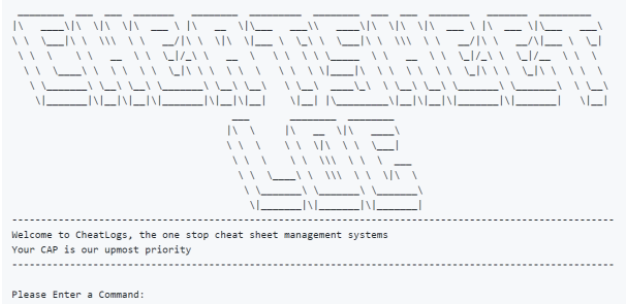
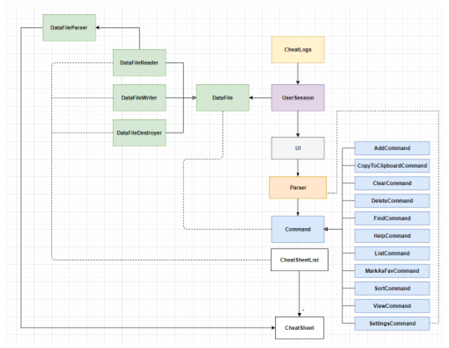
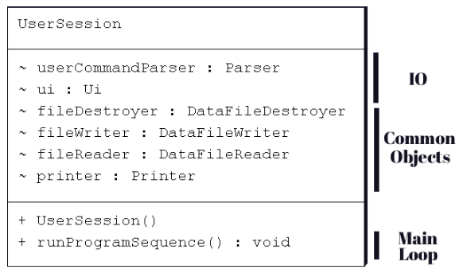
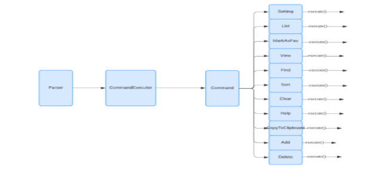
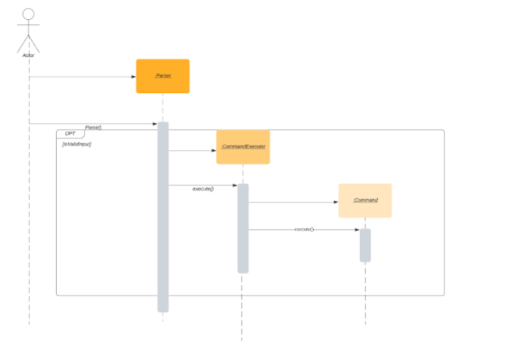
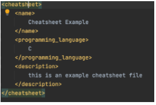
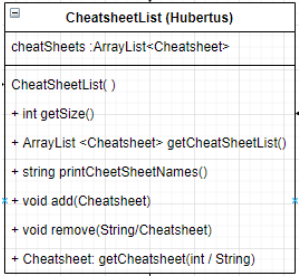

# Developer Guide

# Table of Contents
* [1. Introduction](#1-introduction)
    + [1.1. Purpose](#11-purpose)
    + [1.2. Product Scope](#12-product-scope)
        - [1.2.1. Target User Profile](#121-target-user-profile)
        - [1.2.2. Value Proposition](#122-value-proposition)
    + [1.3. Definitions](#13-definitions)
* [2. Setting Up, Getting Started](#2-setting-up-getting-started)
    + [2.1. Prerequisites](#21-prerequisites)
    + [2.2. Running the Project](#22-running-the-project)
    + [2.3 Importing into IntelliJ [optional]](#23-importing-into-intellij-optional)
* [3. Design](#3-design)
    + [3.1. Architecture](#31-architecture)
    + [3.2. Components](#32-components)
        - [3.2.1. User Interface (Abner)](#321-user-interface-abner)
        - [3.2.2. Command Parser (Brandon)](#322-command-parser-brandon)
        - [3.2.3. Cheat Sheet Structure (Aldo)](#323-cheat-sheet-structure-aldo)
        - [3.2.4. Cheat Sheet Management (Adhy)](#324-cheat-sheet-management-adhy)
        - [3.2.5. Data Storage (Theo)](#325-data-storage-theo)
* [4. Implementation](#4-implementation)
    + [4.1. Parsing of Data to Construct Commands](#41-parsing-of-data-to-construct-commands)
    + [4.2. Editing Feauture](#42-editing-feauture)
    + [4.3. Sorting Feature](#43-sorting-feature)
    + [4.4. Storage & Reading of Cheatsheet files](#44-storage--reading-of-cheatsheet-files)
    + [4.5. [Proposed] Colour coding for code snippet](#45-proposed-colour-coding-for-code-snippet)
* [5. Documentation, logging, testing, configuration, dev-ops](#5-documentation-logging-testing-configuration-dev-ops)
* [6. Appendix: Requirements](#6-appendix-requirements)
    + [6.1 Product scope](#61-product-scope)
    + [6.2 User stories](#62-user-stories)
    + [6.3 Use cases](#63-use-cases)
    + [6.4 Non-Functional Requirements](#64-non-functional-requirements)
    + [6.5 Glossary](#65-glossary)
* [7. Appendix: Instructions for manual testing](#7-appendix-instructions-for-manual-testing)

## 1. Introduction

### 1.1. Purpose

This document specifies the architecture and software design decisions taken to develop our application, CheatLogs. 
Targeted towards developers who are or want to work on CheatLogs.

### 1.2. Product Scope

This document will cover the high-level architecture of the program, as well as the details for the implementation of the features.

#### 1.2.1. Target User Profile

{Describe the target user profile}

#### 1.2.2. Value Proposition

{Describe the value proposition: what problem does it solve?}

#### 1.3. Design Goals

Our main goal is to design a cheatsheet management system that will help novice and beginner programmers to learn and adapt to various programming languages. 
Our cheatsheet app comes with a set of preloaded cheatsheets. 
Additionally, the user can input their own cheat sheets into the application. 
This will make cheatlogs a comprehensive, one-stop solution for every student to manage their cheatsheet.

#### 1.4. Definitions

## 2. Setting Up, Getting Started

### 2.1. Prerequisites

1. JDK 11.0.8
2. Java IDE (IntelliJ Recommended)

CheatLogs has been developed on Java 11 and may not be supported on other versions. 
You are free to use any java file editor and run the program by following the step by step guide below. 

### 2.2. Running the Project

1. Ensure you have Java 11 or above installed in your Computer.
2. Download the latest cheatlogs.jar from here.
3. Move the file to a folder you want to use as the home folder for this application.
4. Invoke java -jar cheatlogs.jar on the command line to run the program. A welcome message should appear, as shown below.

### 2.3 Importing into IntelliJ [optional]

In case you prefer to use IDEs to develop. 
IntelliJ IDEA community edition is a popular free choice. 
After installing a version of it you can import it using the “Get from Version Control” option below and clone from our [repository](https://github.com/AY2021S1-CS2113T-W11-3/tp.).

## 3. Design

This section will elaborate on the architecture and component design of CheatLogs.

### 3.1. Architecture

The image below illustrates the high-level design of CheatLogs.

Image 1: General Architecture of CheatLogs

CheatLogs is split into 5 major components, each handling distinct features of the application. The components and a brief description of them is listed below.
* `UI`: The user interface of the app.
* `CheatSheet`: The structure of each cheat sheet
* `CheatSheetList`: A collection of every cheat sheet.
* `Parser`: Builds a data structure based on user inputs.
* `Command`: An encapsulation of data and methods to execute each command
* `Storage`: Updates application data based on relevant external files.

The UML diagram below illustrates an extensive version of the various classes present in CheatLogs as well as their interactions with each other.

Image 2: In-Depth Architecture of CheatLogs

For each component, it can be further split into different classes which have a unique responsibility. They will be further elaborated upon in the next section.

### 3.2. Components

This application is divided into five different components. 
Each component has a unique function and contributes to the functionality of this application.

#### 3.2.1. User Interface (Abner)

This component handles interactions with the user and manages the input and output of the programme. 

Image 3: User Session class fields and methods

One of the classes is UserSession which contains the main loop of the program. 
Every loop it reads and parses the user input to get a Command object which encapsulates all the necessary information needed to execute the command. 
After execution, it handles potential exceptions thrown.

A single instance of common objects are usually created in UserSession, such as Ui and Printer objects. 
These common objects are injected into other objects that need them via the class constructor instead of static methods.
The common objects include the Ui and  Printer helper classes which provide an organized way to read and write data. 
Most of the programmes’ output is made via calls to the same common printer object.

#### 3.2.2. Command Parser (Brandon)

This component would parse the user input to produce useful information which would be used to construct a Command and executed the command. 

Image 4: Interaction between components to parse and execute command

Image 5: Sequence Diagram from parsing input to command execution

Image 4 and 5 illustrates the interactions between Parser, CommandExecutor and Command when a user inputs an instruction. 

The steps below explain the sequence diagram:
1. User input an instruction
2. A new Parser object is created
3. Parser#parse() is called to extract command type, name, programming language and details from the user-inputted instruction
4. If the user input is valid, a new CommandExecutor object would be created
5. CommandExecutor#execute() would be called to create a new Command object according to type of command user inputted
6. Command#execute() would call other methods from CheatSheet and CheatSheetList to carry out specific instructions.

#### 3.2.3. Cheat Sheet Structure (Aldo)

To further understand our cheatsheet management application, it is important to understand the inner workings of the CheatSheet class. 
CheatLogs comes with preloaded cheat sheets and the application has an in-built ability for the user to add, edit, and delete their own cheat sheets. 
The preloaded cheat sheet cannot be modified by the user, as the user-made cheatsheet is able to be modified by the user.

The CheatSheet class is the class that models the cheat sheet that we used in our program. 
Each of our cheatsheet object is intended to store one cheatsheet topic for one specific programming language (both preloaded and user-created cheat sheets).

This system is intended to increase user access and organization of the cheat sheets.
Each of the CheatSheet object has:
1. 	Name
2. 	Programming Language
3. 	Description (Content of the cheatsheet)
4. 	isFavorite
5. 	isModifiable
6. 	Date Created
7. 	Date Modified

Image 6: class diagram of the cheatsheet class

##### Development Goals

We are trying to move our existing cheatsheet file format from txt to xml. 
XML files provide inbuilt tags to differentiate and classify members of the document. 
With the use of XML file, it simplifies the parsing process of the cheatsheet files into the cheatsheet class, and vice versa.

Image 7: XML file showing the content of a cheatsheet file

#### 3.2.4. Cheat Sheet Management (Adhy)

All cheat sheets, both pre-loaded and user-defined, are stored in one static class called CheatSheetList during runtime. 
Upon receiving a valid input from the user, the execute() method from Command class will invoke the mutation of CheatSheetList, 
and then DataFileWriter will use the information in CheatSheetList to save it to the memory in the form of a txt file.

Image 8: Class diagram of CheatSheetList class

The cheatSheets ArrayList is of type private, and setter/getter methods must be invoked to access the list. 
For these setter and getter methods, it accepts both accessing by index and accessing by name to allow the user to easily search and fetch the cheat sheet. 
When /list or /find command is invoked, printCheatSheetNames will return a string consisting all relevant cheat sheets to be printed by Printer class.

#### 3.2.5. Data Storage (Theo)

This feature allows the application to read and update data in the form of text files. 
Having an external source to store data will allow the application to be able to retrieve it when it is relaunched at another instance. 
This prevents the user from having to repeatedly create new cheatsheets and update the application settings each time he opens up CheatLogs. 

This feature is split into 3 functions, which are indicated in Table 1 below.

| Function | Purpose of Function |
|----------|--------------------------------|
|Read Files|Allows CheatLogs to extract cheatsheets and user-defined settings from text files provided that they follow a specified format.|
|Write Files|Allows CheatLogs to write cheatsheets and user-defined settings to the hard-disk in the form of text files.|
|Delete Files|Allows CheatLogs to remove unnecessary files from the hard-disk.|
Table 1: Summary of the functions of data storage

## 4. Implementation

This section describes some noteworthy details on how certain features are implemented.

### 4.1. Parsing of Data to Construct Commands

The command classes follow the command pattern. 
During construction in Parser.parse() they get the information they need to execute from parsed data based on the user input. 
Flags in the input are used to separate the different information. (e.g. `/add /n if /l python /k is nice`, has 3 flags, /n /l and /k and the String “python" is associated with the flag /l). 
This information is stored in a HashMap where the descriptor (defined in ArgumentEnum) of the flag is the key and the information associated with it is the value.
The command can execute at a random time later via commandObj.execute().12

### 4.2. Editing Feauture

The editing feature is enabled using a simple text editor that uses a graphical user interface. 
The strong reason that we wanted to use a GUI is that it offers more flexibility and editing power for the user rather than just using command-line editing methods.

The editing feature is handled by the TextEditor class. The Text Editor inherits from JFrame and implements the Action Listener class. 
The text editor is instantiated when the edit command is invoked. 

### 4.3. Sorting Feature

This feature allows cheat sheets to be sorted in ascending or descending order according to the name or programming language of the cheat sheet.

This feature is facilitated by ListCommand class. 
It made use of Collections.sort along with sortByName and SortByLanguage which both implements Comparator<CheatSheet>. 

Collections and Comparator forms the private method askForSortingConfigAndPrint(). 
The inclusion of the method allows the user to choose the sorting option and the sorted cheat sheets will be printed.	

Alternative: Using a for loop to sort by name and another loop that sorts by language
Con: There would be many duplicate code and not good for reusability. 
By using the sort() method present in java. util. Collections class, we would have better flexibility as the sort method could be reused with different functions just by including a new class that implements comparable.

### 4.4. Storage & Reading of Cheatsheet files

This feature stores cheat sheets on the hard-drive in the form of a text file. 
When the application is loaded subsequently, data from these files will be converted and loaded into the application.

### 4.5. [Proposed] Colour coding for code snippet

The idea of this feature is to improve the readability of the code snippets (if present) inside the cheat sheet. 
To make this possible, several adjustments must be made to the save data format to allow more information to be stored inside a single file instead of scattered across multiple files. 
Thus, instead of saving to a txt file, the program will write the cheat sheet data into a xml file, for easier parsing and sectioning. 

Given below is an example to illustrate the mechanism.
1. The user launches the application and will be prompted to enter a command
2. The user chooses the /add command, and will be prompted to fill three fields: name, programming language, and details
3. When filling the details, a text editor will pop up. The user now can add their cheat sheet inside this field and he/she can indicate the sections of the cheatsheet using tags similar to markdown
4. The DataFileParser will parse the sections and store the information inside a xml file, with a different tag for each section
5. When the user invokes the /view command, the Printer class will interpret these tags and prepend and append ANSI escape codes to the text

Design consideration:
Alternative 1 (current choice): Saves the file using a xml file, with different tags for each section
* Pros: Allows to store all data in a single file
* Cons: The parsing and saving to the xml file is quite complicated

Alternative 2: Save different sections of the cheat sheet using a different file, and store the files in a folder according to its language
* Pros: The implementation of the parser and file writer is much easier
* Cons: Sections of a single cheatsheet is scattered across multiple files

## 5. Documentation, logging, testing, configuration, dev-ops

## 6. Appendix: Requirements

### 6.1 Product scope

### 6.2 User stories

|Version| As a ... | I want to ... | So that I can ...|
|--------|----------|---------------|------------------|
|v1.0|new user|see a short and comprehensive guide|refer to them when I forget how to use the application|
|v1.0|user|search and filter the cheat sheets by name|open them quickly and easily|
|v1.0|intermediate user|write and add my own cheat sheets|use the application to help me in matters not strictly related to programming|
|v1.0|experienced user|delete all cheat sheets|create and customize everything by myself|
|v2.0|user|edit the cheat sheets|update the cheat sheet and keep them relevant as the time progresses|
|v2.0|user|customize the settings|add and edit the cheat sheets|

### 6.3 Use cases

### 6.4 Non-Functional Requirements

{Give non-functional requirements}

### 6.5 Glossary

* *glossary item* - Definition

## 7. Appendix: Instructions for manual testing

{Give instructions on how to do a manual product testing e.g., how to load sample data to be used for testing}

<!---
There are few major components inside the code, and those components are broken down into separate classes. 
All components can be accessed from the CheatLogs class.
### CheatSheetList
All cheatsheets are stored inside a static class CheatSheetList to allow other classes to easily access and write data to the list.
-->
